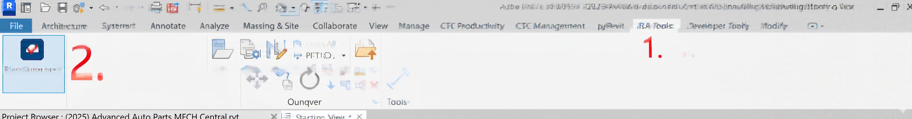
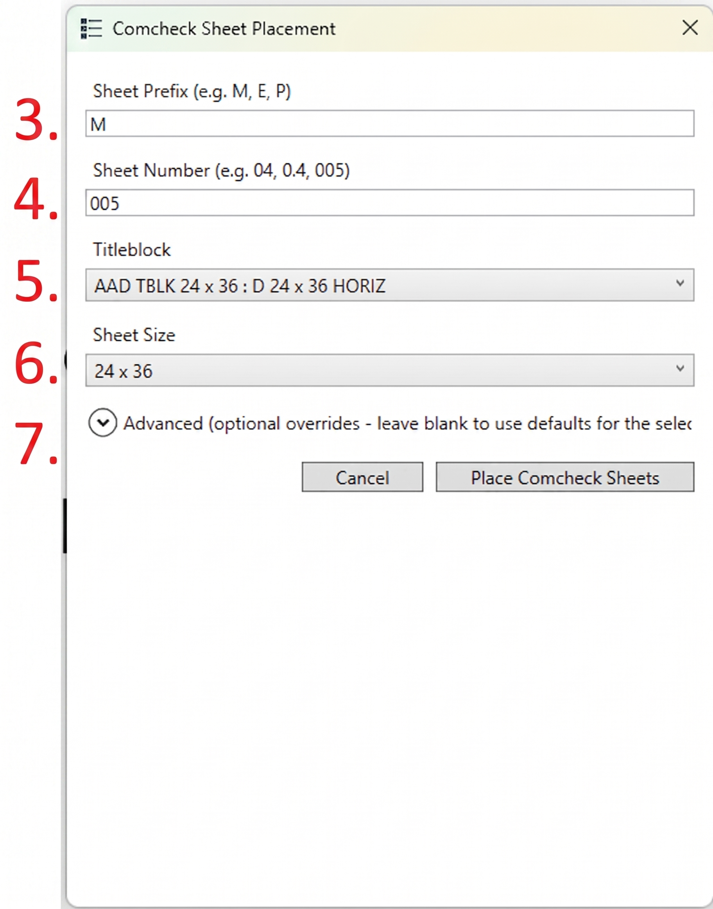
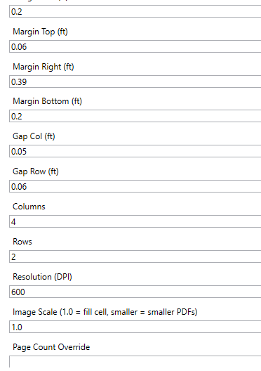

# COMCHECK PLACEMENT TOOL — WORKFLOW

---

**RAMIREZ, JOHNSON, AND ASSOCIATES, LLC**

3301 Lawrence St, Suite 2
Denver, CO 80205

Phone: 720.598.0774

---

## INSTALLATION

Install this extension via the pyRevit Extensions manager (pyRevit tab → **Extensions** → **Add extension from URL**) using:

```
https://github.com/ColinNolan42/ComCheck.extension.git
```

Then reload pyRevit (pyRevit tab → **Reload**) or restart Revit. The button appears under **RJA Tools → Sheets → Place Comcheck**.

---

## WHEN PLACING COMCHECK SHEETS:

### Step 1: Prepare Your Revit Model

Ensure your project file is open and contains at least one titleblock type. The tool will only proceed if titleblocks are available. If you've added new titleblock families to the project, close and reopen the file to refresh the titleblock list.

[SCREENSHOT: Open Revit model with a project file active]

### Step 2: Launch the Comcheck Tool

Navigate to the **RJA Tools** tab in the Revit ribbon, click the **Sheets** panel, and click the **Place Comcheck** button.



1. **RJA Tools Tab** — the published company tab containing released tools. (A separate **Developer Tools** tab may also appear if the in-development extension is installed — ignore it; it is not used for production work.)
2. **Place Comcheck** — the button (Sheets panel) that launches the placement tool. Clicking it immediately prompts for a PDF file.

### Step 3: Select the PDF File

The file browser will open. Navigate to your COMcheck PDF file and click **Open**. The tool will read the PDF to auto-detect the page count and page size (usually 8.5×11" for standard COMcheck reports).

[SCREENSHOT: Windows file browser with COMcheck PDF selected]

### Step 4: Complete the Placement Dialog

After selecting the PDF, the **Comcheck Sheet Placement** dialog appears:



**3. Sheet Prefix** — Enter the letter prefix for your sheets. Examples:
- "M" for Mechanical (typical)
- "E" for Electrical
- "P" for Plumbing

Default value: "M"

**4. Sheet Number** — Enter the starting sheet number. The tool recognizes several formats:
- "005" → generates M005, M006, M007, etc.
- "0.4" → generates M0.4, M0.5, M0.6, etc. (preserves the decimal format)
- "04" → generates M04, M05, M06, etc. (preserves padding)

The last numeric portion is auto-incremented across sheets. Everything before it is preserved. In the example above, "005" with a "24 x 36" titleblock and a multi-page PDF would generate M005, M006, etc., one sheet per group of 8 pages.

**5. Titleblock** — Click the dropdown to select a titleblock family and type from your project (e.g., "AAD TBLK 24 x 36 : D 24 x 36 HORIZ" — family name, then a colon, then the type name). Once selected, all generated sheets will use this titleblock.

**6. Sheet Size** — Choose from two preset options:
- "24 x 36" — Standard sheet size with optimized default layout
- "30 x 42" — Large sheet size with defaults tuned for the larger area

The tool automatically populates the **Advanced** section (item 7) with spacing, margin, and resolution defaults for your chosen sheet size — both when the form first loads and any time you change this dropdown.

**7. Advanced (optional overrides)** — Click the expander arrow to reveal the full set of layout overrides (margins, gaps, grid size, resolution, image scale, page count). See Step 5 below for a field-by-field breakdown. Leave this collapsed and untouched for normal use — the defaults for your selected sheet size are already filled in.

Once steps 3–6 are filled in (and step 7 is left at its defaults, unless you need to tune the layout), click **Place Comcheck Sheets** (Step 8 — see "Review and Place" below) to generate the sheets.

### Step 5: Configure Advanced Options (Optional)

Expand the **Advanced (optional overrides)** section only if you need to adjust layout parameters. All fields are optional — if left blank, the tool uses the default values for your selected sheet size.



The screenshot above shows the **24 x 36** defaults (the values that auto-fill when "24 x 36" is selected in Step 4). Each field is explained in depth below.

**To Customize Spacing (the four Margin fields):**

These control the empty border between the sheet edges and the grid of placed images. All units are **feet** (Revit's internal length unit).

- **Margin Left (ft)** — Distance from the left edge of the sheet to the left edge of column 1. Default for 24x36: `0.2` ft (≈ 2.4"). Increase this to shift the entire grid right (e.g., to clear a left-side binding strip); decrease (even to a negative number) to shift it left.
- **Margin Top (ft)** — Distance from the top edge of the sheet to the top edge of row 1. Default: `0.06` ft (≈ 0.7"). Keep this small but non-zero so images don't print flush to the sheet edge.
- **Margin Right (ft)** — Distance reserved on the right edge of the sheet, **before** the titleblock's information block/border. Default: `0.39` ft (≈ 4.7"). This is intentionally larger than the other margins because most titleblocks place the title/revision block along the right edge — increase this if images overlap the titleblock.
- **Margin Bottom (ft)** — Distance from the bottom edge of the sheet to the bottom edge of the last row. Default: `0.2` ft (≈ 2.4").

**To Adjust Grid Gaps (the two Gap fields):**

These control the spacing *between* images, separate from the outer margins.

- **Gap Col (ft)** — Horizontal whitespace between adjacent columns of images. Default: `0.05` ft (≈ 0.6"). Increase if pages feel cramped side-to-side; decrease (toward 0) to fit more width per image.
- **Gap Row (ft)** — Vertical whitespace between rows of images. Default: `0.06` ft (≈ 0.7").

**To Change Grid Structure (Columns / Rows):**

- **Columns** — Number of image columns per sheet. Default: `4`.
- **Rows** — Number of image rows per sheet. Default: `2`.
- Columns × Rows = images per sheet (default 4 × 2 = **8 pages per sheet**). The tool divides your PDF's total page count by this number (rounding up) to determine how many sheets to create. Changing these values changes both the layout *and* the sheet count math — e.g., 3 columns × 2 rows = 6 pages/sheet, meaning more sheets for the same PDF.

**To Control Image Quality and Fit (Resolution / Image Scale):**

- **Resolution (DPI)** — The resolution, in dots per inch, used when rasterizing each PDF page to an image before placing it. Default: `600`. Higher values (e.g., 1200) produce sharper text/lines when zoomed in or printed at full size, but increase processing time and the size of the Revit model (each placed image is an embedded raster). 600 DPI is generally sharp enough for COMcheck reports printed at normal sheet scale — only raise this if reviewers report blurry text.
- **Image Scale (1.0 = fill cell, smaller = smaller PDFs)** — A multiplier applied to each image's size *within* its grid cell, after the cell size is computed from margins/gaps/columns/rows. Default: `1.0`.
  - `1.0` = the image fills its entire cell (edge-to-edge, aspect ratio preserved — so it may not touch all four sides of the cell if the PDF page's aspect ratio differs from the cell's).
  - `0.9` = image is 90% of the cell's size, centered, leaving a visible ~10% border/gap around it.
  - `0.8` = image is 80% of cell size — a larger visible border.
  - Lower this value if placed images appear to touch, overlap, or crowd each other or the titleblock; raise it back toward 1.0 if there's excessive empty space around each image.

**To Override Page Count (Edge Cases Only):**

- **Page Count Override** — Normally left **blank**. The tool auto-detects the PDF's page count by scanning the file. Only fill this in if the tool fails to detect the page count (rare — typically only with unusual PDF encodings) and you know the correct page count from the source COMcheck report.

**Important**: When you change the **Sheet Size** dropdown (Step 4, item 6), *all* Advanced fields automatically repopulate with the defaults for that size — any manual overrides you typed are discarded. Only change the Sheet Size dropdown first, then make Advanced adjustments afterward, not before.

### Step 6: Review and Place

Review your selections one more time:
- Sheet prefix and starting number
- Titleblock selection
- Sheet size

If any existing sheets in your project already use the sheet numbers you're about to create, the tool will alert you and ask you to choose different sheet numbers. Adjust the Sheet Number field and rerun if this happens.

Click **Place Comcheck Sheets** to begin placement.

[SCREENSHOT: Dialog with all fields completed, Place Comcheck Sheets button highlighted]

### Step 7: Completion and Verification

After the tool finishes, an alert will show:
- Number of sheets created (e.g., "Done! 2 sheet(s) created: M005 to M006")
- The sheet size used

Click **OK** to close the alert. New sheets will now be visible in your Project Browser under **Sheets**.

[SCREENSHOT: Completion dialog showing number of sheets created and sheet number range]

Open one of the newly created sheets to verify:
- All PDF pages are placed in a grid layout
- Images are properly sized and aligned
- The titleblock is correct
- The Comments parameter shows "MECHANICAL" (check via Sheet Properties)

[SCREENSHOT: Revit view showing a COMCHECK sheet with 8 PDF pages in a 4×2 grid]

### Step 8: Iterating and Tuning Layout (Optional)

If the layout does not fit your expectations:

1. Note which parameters need adjustment (e.g., images are too large, gaps too small, margins off-center)
2. Delete the generated sheets (right-click sheet in Project Browser → Delete)
3. Rerun the tool with the same PDF and adjusted Advanced parameters
4. Examples:
   - If images touch or overlap: lower the **Image Scale** to 0.9 or 0.8
   - If gaps between images are too large: reduce **Gap Col** or **Gap Row**
   - If the grid is off-center on the sheet: adjust **Margin Left** or **Margin Top**
5. Generate new sheets and verify until layout is correct

Once satisfied, you can delete old test sheets and keep the final version.

---

**Further instructions and updated screenshots will be added as needed.**
